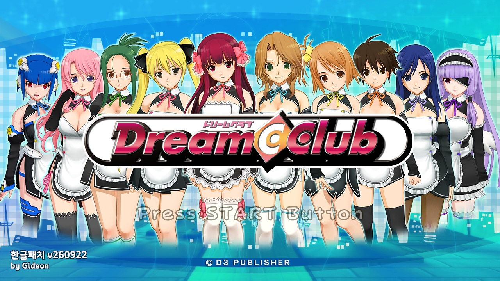
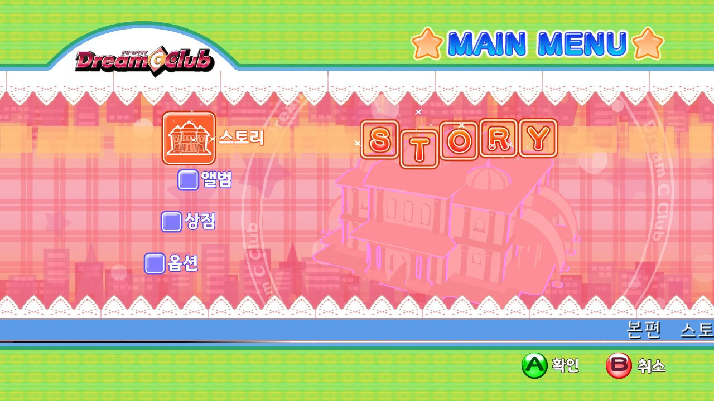
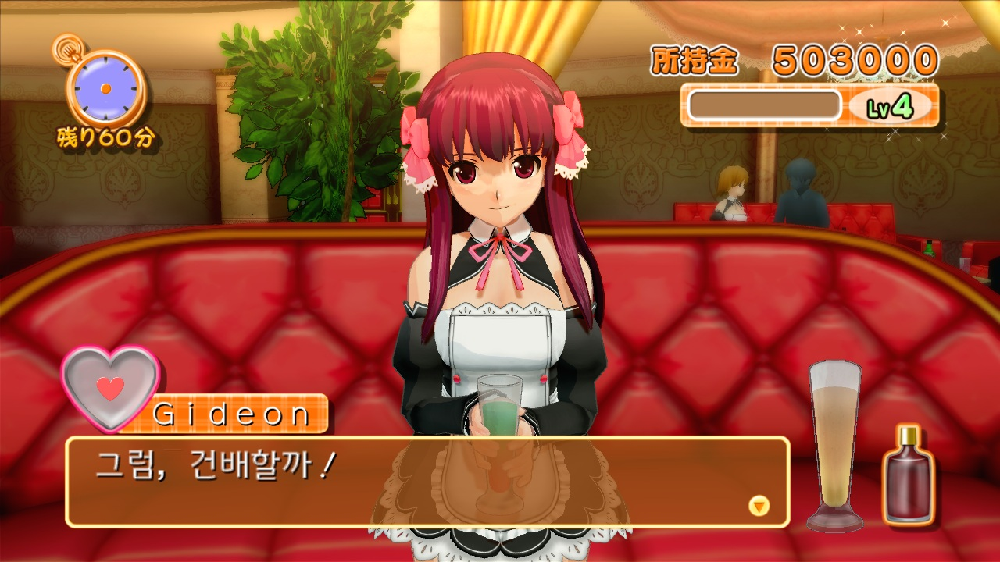
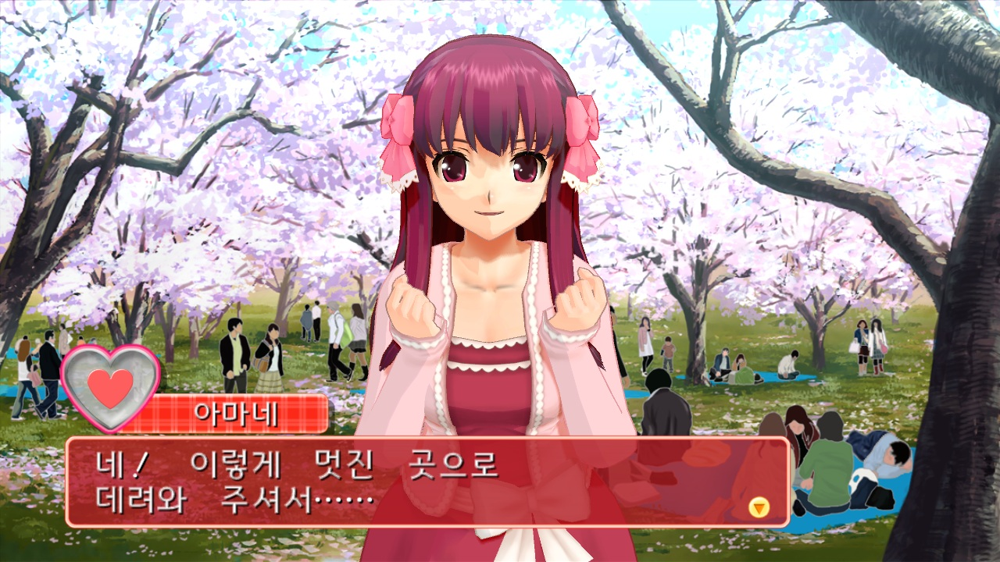

# DreamClubKoreanPatcher

드림클럽 정품 ISO에 한국어 번역을 적용해 새 ISO를 만드는 Windows용 패치 프로그램입니다.

## 샘플 이미지

  
   
  
  

## 요구 사항

* Windows 10 이상
* 사용자가 직접 준비한 정품 게임 ISO
* `xextool.exe` 6.3 버전 [다운로드](https://digiex.net/threads/xextool-6-3-download.9523/)

## 사용법

1. `DreamClubKoreanPatcher.exe`를 실행합니다.
2. 게임 ISO와 `xextool.exe`를 왼쪽 영역에 끌어 놓습니다.
3. TU를 함께 적용하려면 사용자가 준비한 TU 파일 하나를 같은 영역에 끌어 놓습니다. TU는 옵션이며,넣지 않아도 패치할 수 있습니다.
4. `패치 시작`을 누릅니다.
5. 원본 ISO와 같은 폴더에 `_repacked.iso`가 생성됩니다. 같은 이름의 파일이 있으면 시간 표시를 붙여 새로 만듭니다.

## 다운로드

[릴리즈 페이지](../../releases) 에서 다운로드하세요.

본 패치를 다운로드하거나 사용하는 경우 아래의 면책조항 및 이용안내를 확인하고 이에 동의한 것으로 간주합니다.

## 면책조항

본 프로젝트는 비영리 목적의 팬 번역 프로젝트이며, 원작의 저작권은 해당 권리자에게 있습니다.

본 프로젝트는 게임 데이터, 실행 파일 또는 기타 저작권이 있는 원본 데이터를 포함하거나 배포하지 않습니다.

패치를 사용하려면 사용자가 합법적으로 취득한 원본 게임이 필요합니다.

프로젝트 운영자는 본 패치의 사용으로 인해 발생하는 어떠한 손해나 문제에 대해서도 책임을 지지 않습니다.

권리자의 요청이 있을 경우 본 프로젝트는 관련 자료의 공개를 중단하거나 삭제하는 등 필요한 조치를 취할 수 있습니다.

## 라이선스

이 프로젝트는 MIT License를 따릅니다. 자세한 내용은 LICENSE 파일을 참고해 주세요.

Copyright (c) 2026 Gideon

### Fonts

이 프로젝트는 경기천년체 폰트를 사용하고 있습니다.

© GYEONGGI PROVINCE. All Rights Reserved.

### Third-Party Software

This product includes software developed by in <in@fishtank.com>.

자세한 내용은 'docs/THIRD_PARTY_NOTICES' 디렉터리를 참고해 주세요.

---

Developed with GPT-5.x · Translated with Gemma 4
