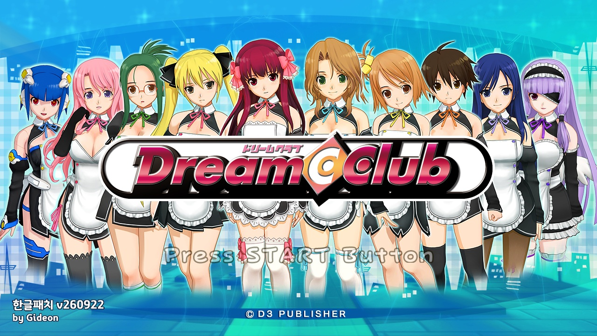
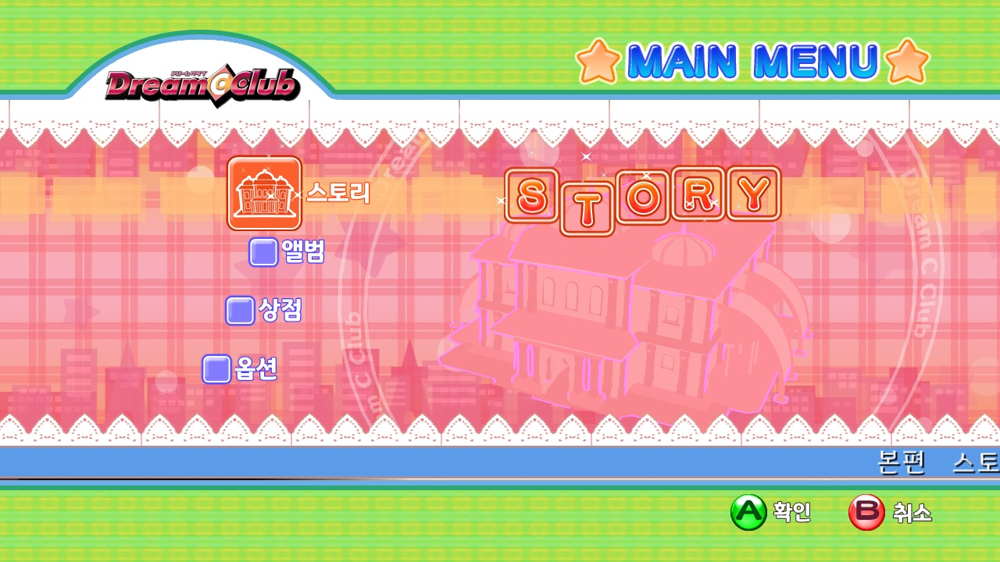
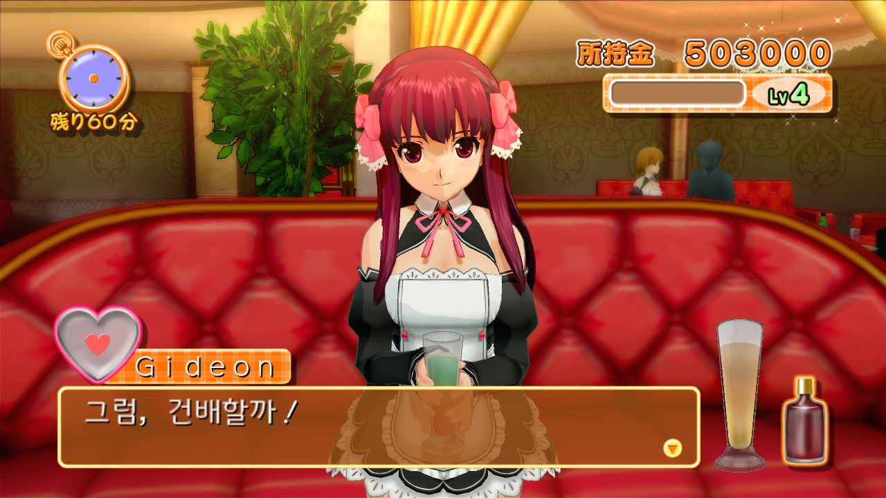
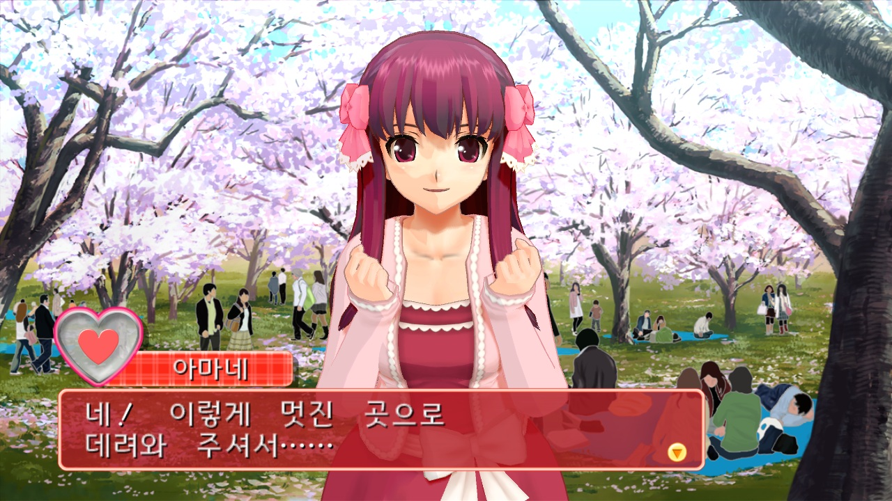

<<<<<<< HEAD
# DreamClubKoreanPatcher
=======
# 드림클럽 한글 패치
>>>>>>> d70536b0bfeda0355d9f176f63f269df847a3302

드림클럽 정품 ISO와 본편 DLC의 텍스트에 한국어 번역을 적용하는 Windows용 패치 프로그램입니다.

## 샘플 이미지

  
   
  
  

## 요구 사항

* Windows 10 이상
* 사용자가 직접 준비한 정품 게임 ISO 또는 지원 원본 DLC
* ISO 패치 시 `xextool.exe` 6.3 버전 [다운로드](https://digiex.net/threads/xextool-6-3-download.9523/)

## 사용법

1. `DreamClubKoreanPatcher.exe`를 실행합니다.
2. 게임 ISO와 `xextool.exe`를 왼쪽 영역에 끌어 놓습니다.
3. 필요하시면 `치트 옵션`을 체크한 뒤 `패치 시작`을 누릅니다.
4. 원본 ISO와 같은 폴더에 `_repacked.iso`가 생성됩니다.

### DLC 텍스트 패치

1. 원본 DLC 패키지가 들어 있는 폴더를 드래그 앤 드롭하거나 `DLC 폴더 선택` 버튼으로 선택합니다. 하위 폴더도 검색합니다.
2. `패치 시작`을 누르면 원본 폴더 옆에 `폴더명_repacked` 폴더를 생성합니다. 그 안에는 원래 DLC 파일명과 하위 폴더 구조를 유지합니다. 예: `DLC/00000002/ABC` → `DLC_repacked/00000002/ABC`.
3. 원본 폴더는 변경하지 않습니다. DLC 이외 파일은 결과에 복사하지 않으며,결과 폴더가 이미 있으면 덮어쓰지 않습니다. 일부 DLC가 실패하면 성공한 결과는 남기고 실패 항목을 표시합니다.
4. DLC만 처리할 때 ISO와 xextool은 필요하지 않습니다. 목록에서 폴더를 선택하고 Delete로 제거할 수 있습니다.

패키지 헤더의 이름은 게임의 DLC 식별자로 쓰이므로 일본어 원본을 유지합니다. 게임 안의 표시 이름·설명·가사를 번역합니다. 이전 버전으로 패치한 DLC는 원본에서 다시 패치하고 재설치해야 합니다.

DLC 한글 표시에는 이 버전으로 다시 패치한 본편 ISO가 필요합니다. 기존 한글 코드 1,339개를 유지하고 부족했던 `넬·잰·캣·틋·팩·횡` 6자를 추가한 공통 프로필을 사용합니다. DLC 처리 자체는 단독으로 실행할 수 있습니다.

재패킹 결과의 블록 해시와 내부 파일은 다시 읽어 검사합니다. 원본 LIVE 서명을 새로 발급하는 기능은 없으며,실제 Xbox 360 및 Xenia에서의 인식·표시 검증은 별도입니다.

명령행에서도 `DreamClubKoreanPatcher.exe --patch-dlc "DLC 폴더 경로" ["추가 폴더 경로" ...]`로 실행할 수 있습니다. 모든 파일이 성공하면 종료 코드 0,하나라도 실패하면 1입니다.

## 다운로드

**[릴리즈 페이지](../../releases)** 에서 다운로드하세요.

본 패치를 다운로드하거나 사용하는 경우 아래의 면책조항 및 이용안내를 확인하고 이에 동의한 것으로 간주합니다.

## 면책조항

본 프로젝트는 비영리 목적의 팬 번역 프로젝트이며, 원작의 저작권은 해당 권리자에게 있습니다.

본 프로젝트는 게임 데이터, 실행 파일 또는 기타 저작권이 있는 원본 데이터를 포함하거나 배포하지 않습니다.

패치를 사용하려면 사용자가 합법적으로 취득한 원본 게임이 필요합니다.

프로젝트 운영자는 본 패치의 사용으로 인해 발생하는 어떠한 손해나 문제에 대해서도 책임을 지지 않습니다.

권리자의 요청이 있을 경우 본 프로젝트는 관련 자료의 공개를 중단하거나 삭제하는 등 필요한 조치를 취할 수 있습니다.

## 라이선스

이 프로젝트는 MIT License를 따릅니다. 자세한 내용은 LICENSE 파일을 참고해 주세요.

Copyright (c) 2026 Gideon

### Fonts

이 프로젝트는 경기천년체 폰트를 사용하고 있습니다.

© GYEONGGI PROVINCE. All Rights Reserved.

취한 상태의 한글에는 Gaegu Regular(400)를 사용하며,없는 글자는 Noto Sans KR Regular(400)로 보완합니다.평상시 경기천년체는 유지합니다.

Gaegu와 Noto Sans KR은 SIL Open Font License 1.1을 따릅니다.라이선스 전문은 배포 폴더의 `Runtime/Fonts/Gaegu-OFL.txt`와 `Runtime/Fonts/NotoSansKR-OFL.txt`에 포함되어 있습니다.

### Third-Party Software

This product includes software developed by in <in@fishtank.com>.

자세한 내용은 'docs/THIRD_PARTY_NOTICES' 디렉터리를 참고해 주세요.

---

Developed with GPT-5.x · Translated with Gemma 4
